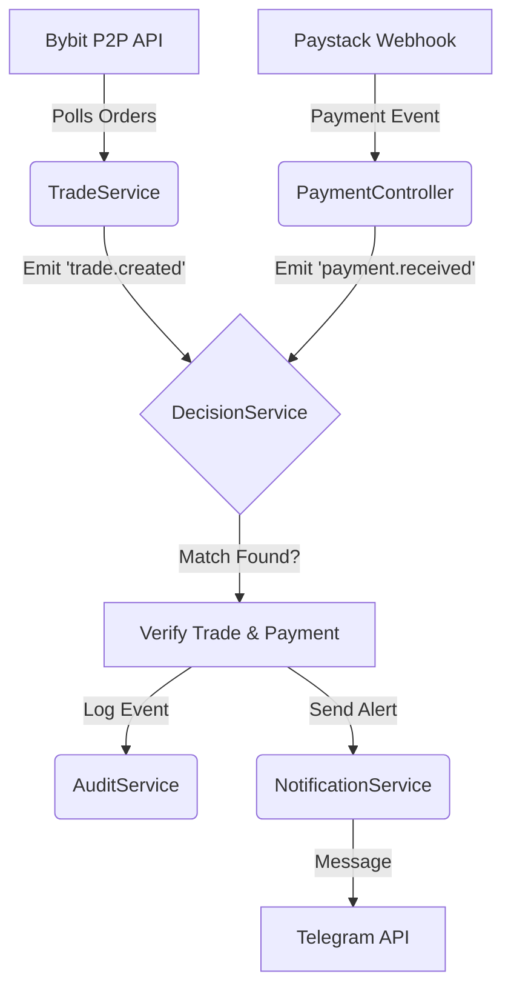

# Trade Monitoring Backend

<p align="center">
  <a href="http://nestjs.com/" target="blank"></a>
</p>

A scalable **NestJS-based** service designed to monitor cryptocurrency P2P trades on Bybit and verify corresponding payments through fintech providers like Paystack. It acts as a bridge between crypto trades and fiat payment confirmations—automating decision-making, sending real-time alerts, and ensuring secure, efficient trade operations.

---

## 🚀 Features

-   **Bybit P2P Trade Monitoring**: Automatically polls and detects new orders/status updates (Paid, Completed, Cancelled).
-   **Payment Verification**: Secure webhook endpoint identifying fiat payments via **Paystack**.
-   **Automated Matching**: Smart logic to match incoming payments with pending trades based on amount and metadata.
-   **Real-time Notifications**: Instant alerts to **Telegram** for matched trades, new orders, or irregularities.
-   **Audit Logging**: Comprehensive database logging of all trade events, payment receipts, and matching decisions for compliance and dispute resolution.
-   **Modular Architecture**: Built with NestJS modules (Trade, Payment, Notification, Audit, Decision) for easy extensibility.

## 🏗 Architecture

The system follows an event-driven architecture using `@nestjs/event-emitter`.



## 🛠 Prerequisites

-   **Node.js** (v18+)
-   **Yarn** or **NPM**
-   **PostgreSQL** Database
-   **Bybit Account** (for API keys)
-   **Paystack Account** (for Webhooks)
-   **Telegram Bot** (for Notifications)

## ⚙️ Installation

1.  **Clone the repository**:
    ```bash
    git clone <repository-url>
    cd trade-monitoring-backend
    ```

2.  **Install dependencies**:
    ```bash
    yarn install
    ```

## 🔐 Configuration

Create a `.env` file in the root directory (copied from `.env.example` if available). Configure the following variables:

```ini
# Database (PostgreSQL)
DB_HOST=localhost
DB_PORT=5432
DB_USERNAME=postgres
DB_PASSWORD=your_password
DB_DATABASE=trade_monitor

# Bybit P2P API
BYBIT_API_KEY=your_bybit_api_key
BYBIT_API_SECRET=your_bybit_api_secret
BYBIT_BASE_URL=https://api.bybit.com

# Paystack
PAYSTACK_SECRET_KEY=your_paystack_secret_key

# Telegram Notifications
TELEGRAM_BOT_TOKEN=your_telegram_bot_token
TELEGRAM_CHAT_ID=your_chat_id
```

## ▶️ Running the Application

**Development Mode:**
```bash
yarn start:dev
```

**Production Mode:**
```bash
yarn build
yarn start:prod
```

## 🧪 Testing

```bash
# Unit tests
yarn test

# E2E tests
yarn test:e2e
```

## 📡 API Endpoints

### Payment Webhook
**POST** `/payment/webhook`

Receives webhook events from Paystack. Requires `x-paystack-signature` header for verification.

**Payload Example:**
```json
{
  "event": "charge.success",
  "data": {
    "reference": "ref_12345",
    "amount": 500000,
    "currency": "NGN",
    "status": "success",
    "customer": {
        "email": "customer@email.com"
    }
  }
}
```

## 📂 Project Structure

```
src/
├── audit/          # Audit logging module
├── common/         # Common utilities
├── decision/       # Core matching logic module
├── notification/   # Notification services (Telegram)
├── payment/        # Paystack integration & Webhooks
├── trade/          # Bybit P2P monitoring
└── app.module.ts   # Main application module
```

## 📄 License

This project is [MIT licensed](LICENSE).
